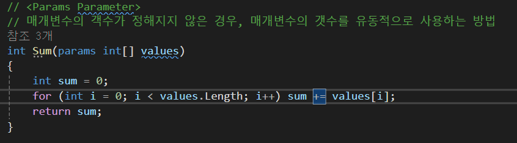
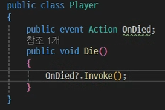

# 확장 메서드

클래스를 수정하지 않고도 기능을 추가 할 수 있음
상속을 통해 만들지 않고도 추가적인 함수를 구현 가능
정적함수의 첫번째 매개변수를 this, 후 확장하고자 하는 자료형을 작성

확장 메서드는 최상위 정적 클래스에 정의해야함
(this 확장하고자 하는 class 매개변수)

# 추가기능

##  Getter Setter
멤버변수가 외부 객체와 상호작용하는 경우 Get & Set 함수를 구현해 주는것이 일반적이다.  

### 장점
1. Get & Set 함수의 접근제한자를 설정하여 외부에서 멤버변수의 접근을 캡슐화한다.
2. Get & Set 함수를 거쳐 멤버변수에 접근할 경우 호출스택에 함수가 추가되어 변수가 변경된 변경시점을 확인 가능하다.

### Property 로 사용 가능
get { return n}
set { n = value}  
혹은  
private int n {get; set;}
작성 할 수 있다.

 public int TotalDamage => (int)(AP * (1+rate)); 이런식으로도 가능

## Params Parameter
매개변수의  개수가 정해지지 않았을때, 매개변수의 갯수를 유동적으로 사용 하는 방법  

## 인덱서
this[]를 속성으로 정의하여 클래스의 인스턴스에 인덱스 방식으로 접근 허용, 배열의 인덱스를 정수가 아닌 열거형으로 쓰기도 한다.

## Nullable 타입

값 형식의 자료형들은 null을 가질 수 없지만 값 형식에도 null을 할당할 수 있는 방법  
bool? b = null;  
int? value = null;  

## Null 조건 연산자
? 앞의 객체가 null 인 경우 null 반환  
? 앞의 객체가 null 이 아닌경우 접근

  
위와 아래가 같은 의미이다.

혹은 이벤트를 쓸 때
  
처럼 사용 할 수 있다.

## Null 병합 연산자
?? 앞의 객체가 null 인 경우 ?? 뒤의 객체 반환  
?? 앞의 객체가 null 이 아닌 경우 앞의 객체 반환

 